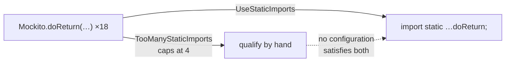

## Context

The six existing rules make code reachable. This pair makes it readable by removing repetition an
import already carries. The trigger is concrete: `VisitDelegationTest` contains 27 hand-written
`Mockito.` and `Visibility.` qualifications, none of them chosen — they exist because
`TooManyStaticImports` capped the file at four static imports.



That is the first head-on conflict with an enabled stock rule in this artifact's history. Every
earlier rule composed or was orthogonal.

## Goals / Non-Goals

**Goals:**

- An import carries the owner; the code should not repeat it.
- Never make a codebase less readable in the name of the rule — hence a floor, an exclusion list, and
  conflict detection.
- Keep the first-run violation count proportional to the work required.

**Non-Goals:**

- Any opinion on how *many* imports a file has. Imports are cheap and the IDE folds them.
- Wildcard imports — `UnnecessaryImport` and Spotless `forbidWildcardImports()` already cover them.
- A configurable exclusion list. Hardcoded; suppression is the escape.
- Prohibiting imports. Neither rule ever says "do not import this".

## Decisions

### The threshold is a floor, and both rules are one-directional

```
name length ≤ 3     rule silent    → PI, of, min, max, now may still be imported by hand
name length > 3     rule reports   → suppress if you disagree
```

Neither rule ever forbids an import, which makes every boundary case cheap. `BigDecimal.ONE` (3) is
not demanded while `BigDecimal.ZERO` (4) is — an inconsistency that would matter in a prohibition and
does not matter in a floor, because a codebase wanting both simply imports both.

The floor also has an independent justification beyond "short names save little": the short static
members of the JDK are overwhelmingly the ambiguous ones — `of`, `get`, `min`, `max`, `now`, `abs`,
`sum`. Exempting them by length happens to protect exactly the cases where a bare name reads worst.

### Type-qualified implies static, so no member resolution is needed

```
Foo.bar(…)
  ├─ qualifier is a TYPE   ⇒ bar is necessarily static (Java forbids instance access via a type)
  └─ qualifier is a VALUE  ⇒ an instance call; not this rule's business
```

The rule therefore visits `ASTMethodCall` / `ASTFieldAccess` whose qualifier is an
`ASTTypeExpression`, and never has to ask whether a member is static. PMD gets the type-ness from the
import declaration rather than the class file, so `Mockito.doReturn` disambiguates without Mockito on
the auxclasspath.

Where PMD cannot disambiguate, the node stays an ambiguous name and the rule under-reports. A miss,
not a false positive — the safe direction, and the same trade `visible-for-testing-rule` made.

**Class literals are not field accesses.** `ASTMethodDeclaration.class` is an `ASTClassLiteral`;
`.class` cannot be statically imported, so it must never be reported. This repository has 15 of them,
so a naive implementation would fail immediately — which is the useful kind of dogfooding.

### Conflict detection does the ambiguity work, so the exclusion list does not

The first sketch of this rule had an exclusion list carrying every name a reader might have to
disambiguate — `copyOf`, `toList`, `sort`. That was wrong. Ambiguity between owners is structural and
decidable within a file:

```
file uses Arrays.copyOf AND List.copyOf   → conflict → force neither;
                                            the developer imports one, or neither
file uses Arrays.copyOf only              → no conflict → force it;
                                            bare copyOf is unambiguous in this file,
                                            and the import line names the owner
```

Once ambiguity is handled structurally, the exclusion list narrows to a different property:
**uninformative** names, where the member name omits the type and the class was the only thing
supplying it.

| | bare form | |
|---|---|---|
| `Collectors.toList` | `collect(toList())` | fine — not excluded |
| `Collectors.groupingBy` | `collect(groupingBy(…))` | fine — not excluded |
| `Files.exists` | `exists(p)` | fine — not excluded |
| `List.copyOf` | `copyOf(xs)` | fine — not excluded |
| `Optional.empty` | `empty()` | **empty what?** — excluded |
| `Duration.ofSeconds` | `ofSeconds(3)` | **of what?** — excluded |
| `Foo.INSTANCE` | `INSTANCE` | **instance of what?** — excluded |

The unifying shape is the **factory-shaped name**: a member that produces an instance of its own
declaring type. That is what the exclusion list encodes, and nothing else.

### Excluded by member name only — there is no owner axis

An earlier draft excluded by declaring class (`Collectors.*`, `Optional.*`, `Collections.*`).
`Collections` killed it: its members are self-describing — `unmodifiableList`, `nCopies`, `reverse`
say what they do without the prefix — so excluding the class would wrongly protect them.

That also exposed a contradiction in `java-coding-conventions`, which lists `emptyList` and
`singletonList` under "static import when self-explanatory" while listing
`Collections.unmodifiableList` under "qualified access when the class name adds clarity". All three
are `Collections` members and the skill gives no distinguishing principle. This change resolves it in
favour of importing all of them, which means **the skill needs another correction** — alongside the
`protected` one already recorded in the archived `add-testability-rules` follow-ups.

With `Collections` out, and `Collectors` / `Files` / `List` / `Set` / `Map` out because conflict
detection covers their ambiguity, the owner axis had nothing left to do. One list, matched exactly or
by camelCase prefix:

```
exact:   value  values  valueOf  empty  create  builder  parse
         now  between  getInstance  newInstance  INSTANCE
prefix:  of[A-Z]…     ofSeconds, ofNullable, ofPattern, ofEpochMilli
         from[A-Z]…   fromString, fromEpochMilli
```

The camelCase boundary in the prefixes is load-bearing: `of[A-Z]` matches `ofSeconds` and not
`offer`, which a naive `startsWith("of")` would swallow.

### Hardcoded, not a property

This is the first rule in the set with a real argument for a knob — the list is closer to taste than
the platform facts encoded by `StaticMethodsModifyStaticState` (the JVM's `main`) or
`UseVisibleForTestingAnnotation` (JUnit's annotations).

It stays hardcoded anyway. Once conflict detection took over the ambiguity cases the list became
short, principled and almost entirely JDK-shaped, and consumers with their own factory methods have
the same escape as everywhere else: `@SuppressWarnings`. The zero-property record across all rules
survives.

### Reported once per file, not once per occurrence

```
per occurrence          24 violations →  2 fixes    the count implies effort that is not there
per distinct member      2 violations →  2 fixes    one violation, one import line
```

`UseStaticImports` reports once per `(owner, member)` pair per file, at the first occurrence;
`UseTypeImports` once per fully-qualified name per file. Stock precedent exists —
`TooManyStaticImports` reports "the first static import in the file" rather than every one.

This is an adoption decision more than a correctness one. A consumer running this over an existing
codebase sees a number, and that number decides whether they adopt the rule or exclude it. Per
occurrence, a large codebase reports thousands of problems that are really a few dozen import lines.

### UseTypeImports splits cleanly with PMD's stock rule

`UnnecessaryFullyQualifiedName` sounded like it already did this. It does not — it fires only when
the simple name is **already in scope**:

> The use of a fully qualified name which is covered by an import statement is redundant.

Write `private java.util.List list;` with no import and it says nothing. So the two partition the
space with no overlap and no double-reporting:

```
simple name already in scope   → UnnecessaryFullyQualifiedName (stock)  "drop the qualifier"
simple name not yet in scope   → UseTypeImports (this artifact)         "add an import"
```

`UseTypeImports` therefore SHALL NOT report a name the stock rule already covers, even for consumers
who do not enable `codestyle` — the split is what keeps the rule honest about what its fix is.

## Risks / Trade-offs

- **Head-on conflict with `TooManyStaticImports`.** → `.pmd.xml` excludes it and the README documents
  the exclusion. Unavoidable: one rule adds static imports, the other caps them. Consumers who enable
  `codestyle` and this ruleset without the exclusion get contradictory demands, which is a worse
  first experience than any previous rule caused. The README must lead with it.

- **Adoption noise even at per-file granularity.** A large codebase will still report a lot on first
  run. → Accepted; the fix is mechanical and IDE-automatable, and per-file reporting keeps the count
  proportional to the number of import lines to add.

- **Under-reporting when PMD cannot disambiguate a qualifier.** → Accepted as the safe direction, and
  documented so a consumer does not read a clean run as proof of compliance.

- **Nested-type FQNs have two valid fixes.** `java.util.Map.Entry` can become `import
  java.util.Map.Entry` + `Entry`, or `import java.util.Map` + `Map.Entry`. → The rule reports and
  lets the developer choose; it does not prescribe which.

- **The exclusion list will be wrong for somebody.** → Suppression, and the list is small enough to
  revisit in a later change rather than being frozen by a property nobody can remove.
