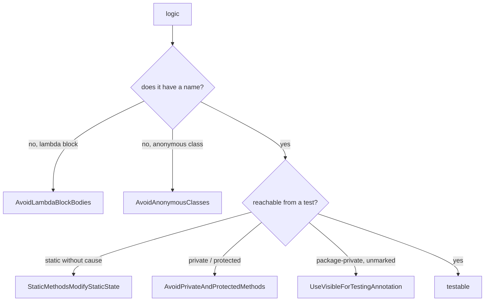

## Context

`add-testability-rules` closed three ways a method can hide from a test — `static`, `private`,
`protected` — and required `@VisibleForTesting` on the seam that resulted. What it did not close is
logic that never becomes a method at all.



The two new rules are the left branch. They are also each other's bypass, which is why they are one
change: banning lambda block bodies alone pushes people into anonymous classes, and an anonymous
class body is the less testable of the two — it can carry several methods and its own fields, and
every rule in the existing set waves it through (not static; `public` and `@Override`; not a lambda).

Both predicates exist at the PMD 7.0.0 floor and neither needs symbol resolution:

| | node | predicate |
|---|---|---|
| `AvoidLambdaBlockBodies` | `ASTLambdaExpression` | `isBlockBody()` |
| `AvoidAnonymousClasses` | `ASTAnonymousClassDeclaration` | node exists, body non-empty, not an enum constant |

These are the cheapest rules in the artifact — nothing like the utility-class walk in
`StaticMethodsModifyStaticState`.

## Goals / Non-Goals

**Goals:**

- Logic lives in something with a name, so a test can call it and a caller can stub it.
- Close both forms at once, so neither is an escape from the other.
- Stay livable: the common case must be a mechanical extraction, not a redesign.

**Non-Goals:**

- Logic inside an *expression* lambda body. `x -> a(x) ? b(x) : c(x)` has two untestable branches and
  is not reported. That is a real gap, deliberately left for a possible future rule about chains and
  branching in expressions. Block-vs-expression is a syntactic proxy for "logic hiding in an
  anonymous place"; it is a good proxy and an easy one to determine, which is why it is the start.
- Named inner classes. They have a name and are instantiable, so they are already reachable.
- Teaching `StaticMethodsModifyStaticState` about static initializers. Rejected below.

## Decisions

### The rule bans block bodies, not lambdas, and never requires a method reference

The intuitive reading of "extract the lambda body" is "use a method reference", and that reading
would be close to unusable: any lambda closing over a local cannot become a method reference at all.

Requiring only a non-block body makes the fix mechanical in every case:

```java
// reported
items.forEach(item -> {
    validate(item, context);
    save(item, context);
});

// compliant — still a lambda, because it must be: it closes over `context`
items.forEach(item -> process(item, context));
```

PMD's stock `LambdaCanBeMethodReference` (in `category/java/codestyle.xml`, enabled by `.pmd.xml`
and not excluded) then reports a bare delegation such as `item -> process(item)` and drives it to
`this::process`. The full cascade spans two rulesets and five stages:

```
x -> { var y = f(x); return g(y); }
  │ AvoidLambdaBlockBodies            → extract the body
x -> mapIt(x)
  │ LambdaCanBeMethodReference (stock) → it is a bare delegation
this::mapIt
  │ AvoidPrivateAndProtectedMethods   → package-private
  │ UseVisibleForTestingAnnotation    → @VisibleForTesting
@VisibleForTesting R mapIt(T x) { … }
```

The rule's description must say the method reference is not required, because readers will assume
otherwise and conclude the rule is unusable before trying it.

### Empty bodies are exempt, in both rules, for the same reason

`() -> { }` and `new TypeToken<List<String>>() { }` contain nothing to extract. In the second, the
empty body *is* the mechanism — an anonymous subclass is how Gson and Jackson capture a generic type
at runtime, and there is no rewrite that preserves it.

An unfixable violation is worse than a missed one, the standard `var-local-variables-rule` set. One
exemption stated once covers both idioms.

This is not hypothetical here: every `-> {` in this repository is the empty form, in the
`UseVarForLocalVariables` fixtures and category examples.

### Enum constant bodies are exempt

PMD represents an enum constant body as an anonymous class — `ASTEnumConstant.isAnonymousClass()`
returns the same `ASTAnonymousClassDeclaration` node the rule visits. A naive rule therefore reports
the strategy enum:

```java
enum Op {
    PLUS  { int apply(int a, int b) { return a + b; } },
    MINUS { int apply(int a, int b) { return a - b; } };
}
```

There is no anonymous-free rewrite that keeps the enum, so this is unfixable and must be exempt. It
is the exemption most likely to be missed, because nothing in the source text says "anonymous class".

### The conflict with StaticMethodsModifyStaticState is resolved by suppression, not by a smarter rule

A block lambda in a static field initializer has no compliant extraction:

```java
private static final Supplier<String> MAKER = () -> {   // AvoidLambdaBlockBodies reports it
    final var a = compute();
    return a + "!";
};

String instanceMethod() { return "x"; }                 // ⇒ the class is not a utility class
```

The extracted method must be `static`, because a static initializer calls it — and
`StaticMethodsModifyStaticState` then reports it, since the class is not a utility class and the
method writes no private static field. No form satisfies both rules.

The tempting fix is to teach Rule A to exempt a static method called only from a static initializer.
It was rejected, because **the exemption is only provable for the form we do not want**:

| extracted form | reachable from a test? | exemption provable in one file? |
|---|---|---|
| `private static make()` | no | **yes** — a private method's call sites are all in this compilation unit, so "only called from a static initializer" is decidable |
| `@VisibleForTesting static make()` | yes | **no** — package-private, so callers may live anywhere in the package |
| `@SuppressWarnings` | yes | n/a — the developer asserts it |

A smart Rule A would bless `private static`, the unreachable form, and still report the reachable one
— forcing a suppression on the good version while rewarding the bad. It would push the wrong way and
fix nothing.

Relaxing it to "referenced from a static initializer anywhere in this file", regardless of
visibility, would bless the right form but is unsound: a package-private static also called from an
instance method elsewhere would slip through. That is a false negative bought with real complexity,
and `method-visibility-rule` already set the precedent — where a check cannot be made honestly, the
rule reports and the developer suppresses.

### The README documents the non-static fix, because the bulk case is the dispatch table

A lone `Supplier` constant is rare. The shape that generates these in quantity is a static table of
behaviour:

```java
private static final Map<String, Handler> HANDLERS = Map.of(
        "create", Example::handleCreate,      // forced static by the field
        "delete", Example::handleDelete);
```

Every handler is forced static and every one is a Rule A violation — one suppression per handler, and
another on every handler added. The real fix is not a suppression but dropping `static` from the
field:

```java
private final Map<String, Handler> handlers = Map.of(
        "create", this::handleCreate, …);
```

Now the handlers are instance methods and the conflict dissolves. This belongs in the README next to
the suppression note, because it is the fix people will not think of and it is strictly better.

### One change, not two

Each rule is the other's bypass. Landing `AvoidLambdaBlockBodies` first would publish a rule whose
documented workaround is a construct the next rule bans — and in the interim the workaround is worse
than the thing it works around.

## Risks / Trade-offs

- **Dogfooding gives no signal.** This repository has no block lambdas and no anonymous classes, so
  `pmdMain`/`pmdTest` will be green whether the rules work or not. → The `pmd-test` fixtures are the
  only evidence. They must cover every scenario in both specs, including the two exemptions, rather
  than relying on the repository to catch a mistake. Verified green before proposing, so a violation
  appearing means the rule is wrong, not the code.

- **The conflict with `StaticMethodsModifyStaticState` is real and unresolved by design.** → Accepted
  with suppression plus the non-static-field guidance. Recorded here so it reads as a decision rather
  than an oversight, and so the next person does not re-derive the "smart Rule A" idea and implement
  it.

- **Test code carries forced blocks.** `doAnswer(inv -> { record(inv); return null; })` must be a
  block: a void call followed by `return null` is not an expression. Extraction works
  (`doAnswer(this::recordAndReturnNull)`) but is noise where inline was clearest. → Accepted; the
  volume should be checked during implementation, and if it is high the empty-block exemption is not
  the right relief — a suppression at the site is.

  **Surveyed during implementation: zero instances here.** This repository's test sources contain
  exactly two lambdas, both expression bodies, and no `doAnswer`, `thenAnswer`, `assertThrows` or
  `assertThatThrownBy` at all. So the shape is not exercised by this project and no relief is needed;
  it stays a documented risk for consumers with heavier mocking, whose answer is a site suppression.

- **Anonymous classes have legitimate uses beyond type capture**, such as a one-off `ThreadLocal`
  initial value. → Those have named-class rewrites and usually a factory alternative
  (`ThreadLocal.withInitial(…)`). No further exemption; suppression remains.

- **`AvoidLambdaBlockBodies` says nothing about a branching expression body.** A reader may conclude
  the rule is arbitrary. → The description states the limit explicitly and names it as the start
  rather than the whole answer.
