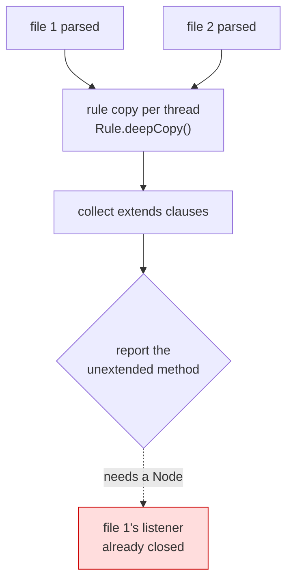
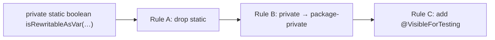

## Context

The rules encode a testing style, not an aesthetic. `spock-coding-conventions` line 164 states it:
when a method calls a sibling on the same object, stub the sibling so the method under test is tested
in isolation. That requires the sibling to be reachable and overridable from the test. `private`
hides it, `static` welds it in place, and neither is negotiable at the language level.

`java-coding-conventions` lines 85–104 already say all of this. It is a skill, so it is advice. This
change converts it into three rules that fail `check`, and — because this repository has run its own
rules on itself since `dogfood-own-rules` — applies them here first.

Five methods in this repository violate them today:

| File | Method | Rule A | Rule B |
|---|---|---|---|
| `UseVarForLocalVariables` | `isRewritableAsVar` | ✔ | ✔ |
| `UseVarForLocalVariables` | `declaresAnInferableType` | ✔ | ✔ |
| `UseVarForLocalVariables` | `isInferableInitializer` | ✔ | ✔ |
| `RulesetDistributionIT` | `analyse` | ✔ | ✔ |
| `RulesetDistributionIT` | `ruleNames` | ✔ | ✔ |

## Goals / Non-Goals

**Goals:**

- Make the shape mechanical rather than advisory, so it cannot be reasoned around.
- Pick one canonical seam form and admit no second one.
- Land the rules and the repository's own compliance in the same change, per the discipline
  `dogfood-own-rules` established.
- Remove the `@DoNotMutate` on `visit()` by making the exemption unnecessary, not by forbidding it.

**Non-Goals:**

- Banning `@DoNotMutate` or `@SuppressWarnings`. Both stay available. An escape hatch that must be
  written down and reviewed is the point; the failure mode being fixed is an exemption nobody had to
  ask for.
- A rule on `final` methods. Mockito's inline mock maker mocks them, so the seam is not closed.
- Cross-module subclass analysis. Not implementable — see below.

## Decisions

### The seam is package-private, not `protected`

`java-coding-conventions` line 88 recommends `protected`. This change overrides that, for three
reasons:

1. **Tighter.** `protected` widens the API to every subclass in every consumer's codebase.
   Package-private widens it to the package, which is exactly where the test lives and no further.
2. **No stock-rule collision.** Verified against PMD 7.26: `AvoidProtectedMethodInFinalClass`
   `NotExtending` and `AvoidProtectedFieldInFinalClass` live in `category/java/codestyle.xml`, which
   `.pmd.xml` enables and excludes neither from. `ClassWithOnlyPrivateConstructorsShouldBeFinal`
   (`design.xml`, also enabled) actively pushes classes toward `final`. A `protected` seam would put
   those three rules in direct opposition and force exclusions. Package-private touches none of them.
3. **Upstream precedent.** PMD's own `CommentDefaultAccessModifier` treats `@VisibleForTesting` on a
   package-private member as the recognised marker for exactly this pattern.

The consequence is that `java-coding-conventions/SKILL.md` now contradicts
`AvoidPrivateAndProtectedMethods`. That skill lives in another repository and must be updated
alongside, or the two sources of truth will fight.

One caveat for the rule description: Mockito and Groovy can both stub a package-private method, but
only when the test is in the same package **and** the same classloader. True for standard Gradle
layouts, false under JPMS with a sealed module.

### Rule A argues meaning, not mockability

The obvious rationale for banning static helpers is that they cannot be mocked. That rationale is
now false — Mockito's inline mock maker mocks statics, and `spock-coding-conventions` line 132
documents `SpyStatic(TheClass)` for exactly that. A reader who checks the mockability claim will
conclude the rule is wrong.

The durable justification is informational. Today `static` on a method means any of five things:
helper, factory, constant accessor, entry point, class-state mutator. It therefore carries no
information. Under this rule it means one thing — *this method writes class-level state* — and
seeing it tells the reader where to look.

That is what the rule's `<description>` must say.

### "Writes a private static field" means assignment

```
allowed:    FIELD = x        FIELD += x        FIELD++        --FIELD
reported:   return FIELD     REGISTRY.put(k,v)   FIELD.size()
```

A read is not a write. A static method that only returns a private static field is an accessor whose
encapsulation was already fake — the field should have been public.

A mutating call on a private static field is undecidable: PMD cannot know that `put` mutates and
`size` does not. It is therefore reported, which has a consequence worth stating plainly: **a
`private static final` field can never justify a static method**, since a final can only be assigned
in its initializer. A registry or cache built on a `private static final Map` must either become a
utility class or move onto an injected instance — the latter being the case where the global-mutable-
state argument genuinely holds.

Scope: the field must be declared in the same top-level type, which is what "internal" means to a
reader and matches what Java's access rules permit.

Compatible with the stock rules already enabled: `MutableStaticState` matches
`[static][not(private or final)]`, so private static fields are outside it and this exception does
not fight it.

### Rule A's carve-outs are the cases with no compliant rewrite

`var-local-variables-rule` sets the precedent: a violation the consumer cannot fix is worse than a
missed one. These have no instance-method form at any price:

- `public static void main(String[])` — the JVM entry point.
- `@BeforeAll` / `@AfterAll` — JUnit 5 requires static outside `PER_CLASS` lifecycle.

`@MethodSource` providers must also be static, and are deliberately **not** carved out: the
annotation sits on the test method and names the provider by string, so no structural check can tell
a provider from any other static method. Those suppress. Spring's `static @Bean` factories are the
same shape and the same answer.

### Rule C is a custom rule, not configuration of `CommentDefaultAccessModifier`

PMD's `CommentDefaultAccessModifier` almost does this already: set `regex` to something unmatchable
so a comment cannot satisfy it, and `@VisibleForTesting` becomes the only way through. It is
rejected on the project's own constraint:

> **`rule-distribution`:** shipped resources reference no external ruleset, so they resolve
> identically under every PMD 7 version.

A stock rule with property overrides cannot go in `rulesets/java/joke.xml`. It would live as copied
configuration in every consumer's `.pmd.xml` — including a restatement of the full 25-entry
`ignoredAnnotations` list, because PMD multi-value properties **replace** the default rather than
append, and `org.jetbrains.annotations.VisibleForTesting` is missing from it upstream.

A custom rule ships in the ruleset, needs no consumer configuration, and matches `@VisibleForTesting`
by **simple name** — so it works for the JetBrains, Guava, Error Prone and AndroidX annotations
alike, and has no FQN list to go stale. PMD's type resolution needs an `auxclasspath` consumers often
do not configure, which is a second reason to match on the name.

`CommentDefaultAccessModifier` stays excluded in `.pmd.xml`. It also covers fields, constructors and
nested classes, which Rule C does not; extending Rule C to those is a later change if wanted.

### The cross-module subclass check is not implementable

The considered alternative to banning `protected` outright: report it only when no subclass in the
same Gradle module uses it. Verified against PMD 7.26 — it cannot be built as a PMD rule.



Three facts, each fatal on its own:

| API | Consequence |
|---|---|
| `Rule.deepCopy()` | Rules are copied per analysis thread; instance state never aggregates across files. |
| `RuleContext.addViolation(…)` | Every overload requires a `Node` (or `Reportable` + `AstInfo`). No violation can be reported without a live parsed file. |
| `Rule.end(RuleContext)` | Fires per thread-batch against the last file processed. Earlier files' listeners are closed. |

PMD's unit of analysis is one compilation unit; "does any subclass exist" is a whole-module question.
The part that *is* provable in one file — `protected` in a `final` class, where no subclass can exist
— is already covered for free by the stock `AvoidProtectedMethodInFinalClassNotExtending`.

If the exact check is ever wanted, it belongs over bytecode in a Gradle verification task walking
`sourceSets.main.output` with ASM or ClassGraph, where the whole module is in one place. That is a
different deliverable from a publishable PMD ruleset and is out of scope here.

### Rules cascade rather than pile up



`AvoidPrivateAndProtectedMethods` skips `static` methods, leaving Rule A to fix staticness first.
One method then produces one violation per run with one obvious fix, instead of three simultaneous
reports on one line.

### Mockito, not Spock

`build-foundation` forbids Groovy and Spock in the `rules` module, and `openspec/config.yaml`
records it as a standing constraint. Mockito sits directly alongside the existing JUnit 5 tests and
needs no second language. The `pmd-test` XML fixtures stay — they are the only end-to-end check of
rule behaviour, and Mockito replaces none of them. Rule classes gain a second, narrower test style
for the branches fixtures cannot reach.

Mockito 5's default inline mock maker is what makes `final` methods a non-issue and is why no fourth
rule is needed.

## Risks / Trade-offs

- **Three rules that fire on essentially every existing Java codebase.** → Accepted; that is the
  point. Every violation has a mechanical rewrite, and `@SuppressWarnings` stays available for
  genuine extension points and framework-forced statics. The README must be explicit that
  suppression is expected rather than a failure.

- **`UnusedPrivateMethod` stops working.** Once helpers are package-private, PMD's stock rule no
  longer detects dead ones, and nothing replaces it. → Accepted as a real, unmitigated cost.

- **The rules contradict `java-coding-conventions/SKILL.md`.** → Must be fixed in the
  `claude-plugins` repository. Until then an agent reading the skill will write `protected` and the
  build will reject it — noisy but self-correcting, since the build wins.

- **Rule A bans static factory methods** (`Foo.of(…)` on a class with instance methods writes
  nothing). This is a mainstream Java idiom. → Deliberate: a constructor exists and is the compliant
  form. Recorded here so it reads as a decision rather than an oversight.

- **Mutation coverage of three new rules at 100/100/100.** → The reason the seam form exists. The
  new rules are written in the shape they enforce from the first commit, so their own branches are
  reachable from tests.

- **Removing `@DoNotMutate` could fail `pitest`** if the spied test does not in fact kill the
  mutants on `visit()`. → Sequenced as its own task before the annotation is deleted; if the spy
  cannot kill them, the annotation stays and the reason is recorded, since the rules land either way.
