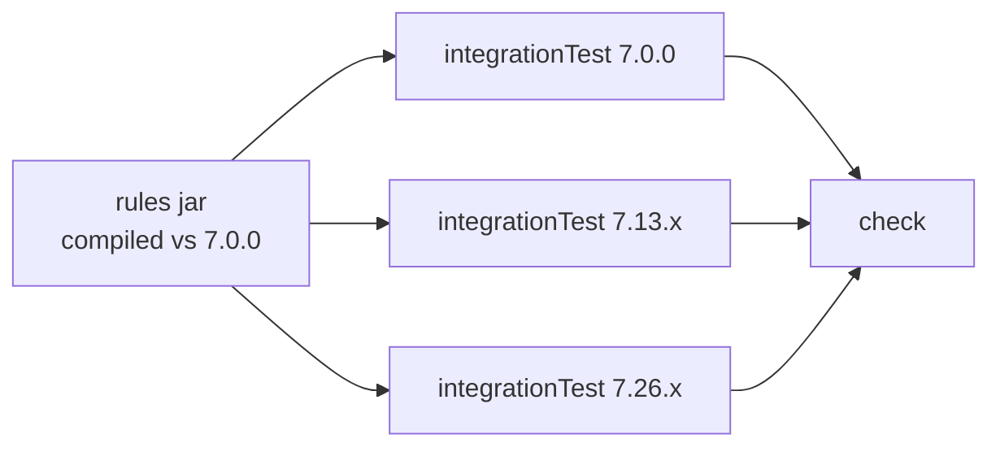

## Context

The repository is empty apart from `.claude/` and `openspec/`. Everything — build, CI, release
apparatus, and the first rule — is created here.

The build is not designed from scratch. `jspecify` (`/home/joke/Projects/joke/jspecify`) already
solves module layout, version derivation from conventional commits, release-please manifest mode,
snapshot-rehearses-release publishing, GPG signing and Maven Central delivery. Its
`build-foundation` spec is the starting point and most of it transfers unchanged. The design work
is in the places where a PMD rules artifact differs from an annotation processor.

Three constraints shape those differences:

- The artifact runs **inside** the consumer's PMD. It is loaded by PMD's `RuleSetLoader` from the
  Gradle `pmd` configuration, at whatever PMD version the consumer chose. This project does not
  control the runtime.
- The consumer must remain free to pick their PMD version. That freedom is the reason the artifact
  exists as a jar rather than as copied XML.
- A future centralized conventions plugin will ship this artifact. The convention plugin living in
  `buildSrc` here is a temporary home for code destined to be extracted, exactly as
  `io.github.joke.conventional-version` was extracted before it.

## Goals / Non-Goals

**Goals:**

- A published `io.github.joke.pmd:rules` artifact that a Gradle project consumes in two lines.
- Rules implemented in Java, unit-tested and mutation-tested, not untested XPath strings.
- Compatibility across PMD 7.x proven by CI, not asserted in a README.
- A build that is a faithful, minimal adaptation of `jspecify`'s, so the two stay comparable and
  the eventual convention-plugin extraction is mechanical.
- One seed rule that exercises the whole path from Java source to published ruleset.

**Non-Goals:**

- Extracting the convention plugin. It stays in `buildSrc` until a second consumer exists.
- Dogfooding these rules in this repository's own build. That is the convention plugin's job later.
- An opinionated ruleset that combines PMD's stock categories with these rules.
- Any rule beyond the seed. Rules are added by later changes, one per change.
- Supporting PMD 6.

## Decisions

### Rules are implemented in Java, not XPath

XPath rules would make the artifact a resources-only jar, which means no `java` plugin, and
therefore no Error Prone, no NullAway, no Spotless and — decisively — no Pitest. The convention
plugin's most opinionated machinery would be inert, and the rules would be exactly as untested as
the inline XPath they replace. The `UseVarForLocalVariables` snippet in `jspecify`'s `.pmd.xml`
matches on `Type/@Image`, a PMD 6 AST attribute; nothing in that project reports that it has
stopped matching. That failure mode is the motivation for this decision.

Java rules extend PMD's `AbstractJavaRule` / `JavaVisitorBase` and are unit-testable as ordinary
classes.

_Alternative considered_: XPath rules with `pmd-test` XML descriptors for verification. Rejected —
it verifies the rules but leaves the artifact outside every other quality gate the build applies.

### Compile against PMD 7.0.0, declared `compileOnly`

Rules compiled against an old PMD API run on newer PMD; the reverse throws `NoSuchMethodError` at
analysis time, in the consumer's build, with a stack trace that points at PMD rather than at this
artifact. Compiling against the floor rather than the ceiling is what makes the floating-version
promise safe.

7.0.0 is the floor. `pmd-core` and `pmd-java` are `compileOnly`: Gradle's `pmd` configuration
supplies them at analysis time, and declaring them at any scope that reaches the POM would impose
a version on every consumer — the precise thing the artifact exists to avoid.

_Alternative considered_: compile against the newest PMD and declare a minimum in the README.
Rejected — it inverts the safe direction and makes the minimum a claim rather than a property.

### The published POM declares no dependencies, enforced by a check

`jspecify`'s `verifyPomHasNoDependencies` task transfers unchanged. It parses the generated POM and
fails `check` if any dependency is declared. A leak here is silent — it only surfaces as a version
conflict in a consumer's build — so it is verified mechanically rather than by review.

`pmd-test` is `testImplementation` and pulls `pmd-core` transitively at test scope. That does not
reach the POM, so the check still passes.

### Resources use PMD's category/ruleset split, referencing nothing external

```
src/main/resources/
├── category/java/joke.xml     every rule: class=, description, priority, examples
└── rulesets/java/joke.xml     <rule ref="category/java/joke.xml"/> — all of them
```

The category file is the catalogue: PMD's designer, documentation tooling and `<rule ref=...>` by
name all read it. The ruleset is the convenience selection consumers point at.

Neither file references PMD's stock categories. This matters more than it appears: `<exclude
name="..."/>` against a stock category resolves at *the consumer's* PMD version, and PMD renames
and removes rules across minor releases, where a stale name is a hard ruleset-load failure. By
referencing only its own file, the artifact is decoupled from PMD's rule catalogue as well as from
its binary API, and floats across 7.x on both axes.

Consumers compose stock categories themselves:

```groovy
dependencies { pmd 'io.github.joke.pmd:rules:1.2.3' }
pmd { ruleSets = ['category/java/bestpractices.xml', 'rulesets/java/joke.xml'] }
```

_Alternative considered_: publish one opinionated ruleset combining stock categories, exclusions
and property overrides — effectively `jspecify`'s `.pmd.xml` as a resource. Deferred to the
conventions plugin, which is the right place to pin a PMD version alongside such a ruleset.

### JUnit 5 with `pmd-test`, not Spock

PMD ships `net.sourceforge.pmd:pmd-test`, a JUnit 5 harness (`RuleTst` plus XML test descriptors
carrying `<test-code>` / `<expected-problems>`). It is what every PMD contributor reads fluently and
it removes the need to hand-roll an analysis harness.

Adopting it means dropping Groovy from the `rules` module, and with it Spock, `SpockConfig.groovy`,
the Groovy and Spock BOMs, and the `-Dspock.parallel.disabled=true` Pitest argument. CodeNarc
configuration stays in the convention plugin and in `.codenarc.groovy`: both are inert here because
nothing applies the `groovy` plugin, but the plugin is destined for extraction and re-deriving them
later is pure waste. The `test`/`integrationTest` split by tag survives, expressed with JUnit's
native `@Tag` instead of Spock's.

### Java 11 on main only — Java 8 was attempted and abandoned

`options.release = 11` applies to the main source set. Test source compiles at the toolchain's own
release level: test code never ships, and constraining it costs text blocks, records and pattern
matching in fixtures for no benefit. This is a deliberate divergence from `jspecify`, which applies
one release level to every `JavaCompile`.

Java 8 was the original intent and it does not survive contact with NullAway. At `--release 8`,
javac cannot resolve `ElementType.MODULE` while reading JSpecify's `@NullMarked` — that constant
arrived in Java 9 — and emits a warning that `-Werror` turns into a build failure:

```
$ javac --release 8 -Werror -cp jspecify-1.0.0.jar package-info.java A.java
warning: unknown enum constant ElementType.MODULE
error: warnings found and -Werror specified
```

No `-Xlint` category suppresses it; `-Xlint:-classfile` was tested and has no effect, because javac
emits this unconditionally when reading an annotation with an unresolvable enum constant. `--release
9` and above are clean, as is `--release 8` with JSpecify absent. Java 8 and NullAway are therefore
mutually exclusive here, and the choice is between them.

NullAway wins. The reach forfeited is narrower than it first appears: the JVM that must run this
jar is the one running PMD, not the one the analysed source targets. Any Gradle 9 build already runs
on Java 17 or later, so Java 8 bytecode would only serve Maven and Ant builds invoking PMD on a
Java 8 JVM. Analysing Java 8 *source* is unaffected — that is a property of the consumer's PMD
language version, not of this artifact.

11 rather than 9: 9 is the minimum that resolves the problem, but it is not an LTS and nothing else
in the stack targets it.

_Alternatives considered and rejected_: dropping NullAway and `RequireExplicitNullMarking` from the
rules module to keep Java 8, which trades a permanent quality gate for a narrow compatibility
window; and dropping `-Werror` on main, which weakens a gate globally to work around one
unsuppressable warning.

### Cross-version compatibility is a build task, not a CI-only matrix

The compatibility claim is verified by `integrationTest` tasks registered one per supported PMD
version, each resolving `pmd-core` and `pmd-java` at that version into its own configuration and
running the built rules jar against a fixture tree.



Keeping this in the build rather than in a GitHub Actions matrix means `./gradlew check` reproduces
it locally, which is where a compatibility break is cheapest to find.

These integration tests do not use `pmd-test`: `RuleTst` is itself versioned and would confound a
PMD-version failure with a harness-version failure. They drive `PmdAnalysis` directly through the
API subset that is stable across 7.x — `PMDConfiguration`, `RuleSetLoader`, `PmdAnalysis`,
`RuleViolation` — loading `rulesets/java/joke.xml` from the classpath exactly as a consumer would.
That also exercises the classpath ruleset resolution the whole distribution model depends on.

### The seed rule is `UseVarForLocalVariables`

It is the rule that motivated the project, it is small, and porting it from PMD 6 XPath to a Java
PMD 7 rule proves every part of the layout: a rule class, a category entry, a ruleset entry, unit
tests, mutation coverage, and cross-version execution.

### Coordinates and repository

Group `io.github.joke.pmd`, artifact `rules`, module directory `rules`, repository `pmd-rules`.
`.github/settings.yml` is authored fresh rather than copied — `jspecify`'s copy still names the
`percolate` repository it was itself copied from, which is the failure mode this decision avoids.

## Risks / Trade-offs

- **PMD 7.0.0 marks more API `@Experimental` than later 7.x, particularly around type resolution.**
  A rule needing type information may find no stable API at the floor. → Discover per rule. A rule
  that genuinely requires newer API raises the floor for the whole artifact and is a decision worth
  making explicitly, not a reason to compile against a newer PMD by default.

- **Pitest at 100/100/100 is materially harder on AST visitors than on `jspecify`'s deliberately
  tiny processor.** Visitor code is branch-dense — null checks, `instanceof` ladders, node-type
  dispatch — and mutants die only where fixtures cover the branch. → Accept the cost: a fixture per
  branch, written deliberately. The seed rule is small enough to establish the pattern before the
  rule count grows.

- **Classpath ruleset resolution is the single mechanism the distribution model rests on.** If
  `ruleSets = ['rulesets/java/joke.xml']` does not resolve from the `pmd` configuration, the
  artifact is unusable regardless of how good the rules are. → The cross-version integration tests
  load the ruleset by classpath reference, so this is exercised on every build rather than
  discovered by the first consumer.

- **`UseVarForLocalVariables` cannot be applied to this repository's own Java 8 source.** When the
  conventions plugin later dogfoods these rules, this repository must exclude its own seed rule. →
  Harmless today; noted so the dogfooding change is not surprised by it. The alternative — raising
  this project's own baseline above 8 — would defeat the point of shipping Java 8.

- **Java 11 excludes consumers running PMD on a Java 8 JVM.** PMD 7.26 itself still ships Java 8
  bytecode, so such consumers exist in principle. → Accepted as the price of NullAway. Gradle 9
  builds are unaffected, and the constraint is on the JVM running PMD, not on the source being
  analysed.

- **CodeNarc and `.codenarc.groovy` are dead configuration in this repository.** → Retained
  knowingly; they are `withPlugin`-guarded, cost nothing at build time, and are required by the
  convention plugin's eventual extraction.

- **The convention plugin will be duplicated between this project and `jspecify` until extraction.**
  Divergence between the two copies is likely. → Accepted for now; the divergences here are
  deliberate and enumerated above, which is what the extraction will need to reconcile.
