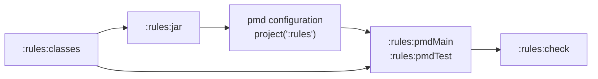

## Context

The bootstrap change deliberately left this project's own build using PMD's stock categories only,
deferring dogfooding to a future centralized conventions plugin. The reason it recorded — Java 8 has
no `var`, so the seed rule could not apply here — stopped being true within the same change, when
the language level moved to 11 because Java 8 and NullAway turned out to be mutually exclusive. The
comment in `.pmd.xml` still states the dead reasoning.

The precondition for this change was verified before proposing it. Running
`rulesets/java/joke.xml` over `rules/src/main/java` and `rules/src/test/java` with PMD 7.26 reports
zero violations. The four Java files in this repository already use `final var` throughout, partly
because `LocalVariableCouldBeFinal` from PMD's stock `codestyle` category is already active and
partly because the java11 conventions call for it.

So this is a wiring change with no code cleanup attached — which is the whole reason to do it now
rather than later.

## Goals / Non-Goals

**Goals:**

- The build runs the rules it publishes against its own source, on every `check`.
- Wire it while the repository is green, so the change is verifiable as pure wiring.
- Make the failure mode survivable: a rule that throws breaks the build that produces it, and the
  person hitting that needs to be told how to get out.
- Protect the property that makes dogfooding safe — deliberate violations live in test fixtures, and
  fixtures are XML.

**Non-Goals:**

- Adding any rule. The rule inventory is a separate change.
- Deciding whether "protected over private, instance over static" applies to PMD rule classes. That
  question decides what the *next* change looks like, not this one.
- Extracting the convention plugin, or making other projects consume this artifact.
- Migrating `jspecify` off its PMD 6 XPath copy of `UseVarForLocalVariables`.

## Decisions

### Dogfood through `project(':rules')`, not the class directory



`project(':rules')` puts the packaged artifact on the analysis classpath, which is what a consumer
gets. `pmd files(sourceSets.main.output)` would also work and skips the packaging step, but it
analyses a loose directory of classes and resources — a shape no consumer ever sees, and one that
cannot catch a packaging fault such as a resource excluded from the jar.

No cycle exists: `jar` does not depend on `pmdMain`. The graph gains `pmdMain → jar → classes`
alongside the existing `pmdMain → classes`.

A project depending on **itself** through a configuration is unusual, and this design did not assume
Gradle accepts it. Verified during implementation: Gradle accepts it, no circular task dependency
arises, and `:rules:jar` is correctly ordered before `:rules:pmdMain`. The
`pmd files(sourceSets.main.output)` fallback was not needed.

### The jar joins the `pmd` configuration by inheritance, not by direct declaration

Declaring `pmd project(':rules')` directly does not work, for a reason that is invisible until you
try it. Gradle's `PmdPlugin` supplies PMD itself via `defaultDependencies`, which fires only while
the configuration's own dependency set is empty. Adding our jar therefore **replaces** the tool:

```
pmd project(':rules')   →  ClassNotFoundException: net.sourceforge.pmd.PMD
```

Re-declaring PMD by hand alongside it is worse than it looks — `pmd-java` alone is not enough
(`ClassNotFoundException: net.sourceforge.pmd.ant.PMDTask`), and the full set Gradle would have
added varies by Gradle version, so hardcoding it is a latent break on every Gradle upgrade.

The fix is to declare the dependency on a separate configuration that `pmd` extends from.
`defaultDependencies` inspects `dependencies`, not `allDependencies`, so an inherited dependency
leaves the default intact and both arrive on the analysis classpath.

### `ruleSetFiles`, not `ruleSets`

The convention plugin inherited `ruleSets = ["$rootDir/.pmd.xml"]` from `jspecify`. `ruleSets` is a
`List<String>`, which Gradle cannot track as a file input, so editing `.pmd.xml` left `pmdMain`
`UP-TO-DATE` and analysing against the previous ruleset. That was tolerable while the ruleset was
static; it is not tolerable here, because dogfooding is only trustworthy if enabling a rule visibly
takes effect.

`ruleSetFiles` is a `FileCollection` and is tracked. Switching requires clearing `ruleSets`, which
otherwise retains Gradle's default of `category/java/errorprone.xml`.

This is a fix to a pre-existing latent fault rather than something this change introduced, and it is
in scope because the change's central requirement cannot otherwise be verified.

### Reference the shipped ruleset from `.pmd.xml`, alongside the stock categories

`.pmd.xml` is the repository's own ruleset and already composes PMD's stock categories with
exclusions and property overrides. Adding `<rule ref="rulesets/java/joke.xml"/>` to it is exactly
the composition the README documents for consumers, so the repository's own configuration doubles as
a worked example of the documented wiring.

This does not contradict the rule that *shipped* resources reference no external ruleset.
`.pmd.xml` is not shipped — it is this repository's build configuration, and composing stock
categories is precisely the consumer's job that the shipped resources decline to do.

### Apply to both `pmdMain` and `pmdTest`

Test source is the larger body of code here and is not release-constrained, so it exercises the rule
against more varied Java than the four main-source files do. Excluding it would leave most of the
repository unchecked by the rules it publishes.

### Fixtures stay in the `pmd-test` XML descriptors

The rule's test data contains deliberate violations — that is what it is for. It is invisible to
`pmdMain`/`pmdTest` only because it lives inside `rules/src/test/resources/.../xml/*.xml` rather
than in `.java` files. Some PMD projects put rule test data in real source files under a `testdata`
package; doing that here would make the build flag its own fixtures, and the obvious repair —
excluding the fixture path from PMD — would quietly also exclude anything else that ever moved
there.

Keeping fixtures in XML is therefore a constraint worth stating rather than a coincidence worth
relying on.

### Document the recovery path in the README

A rule that throws during analysis fails `pmdMain`, which fails `check`, in the same module that
builds the rule. The repair is to edit the rule that is currently breaking the build. That is
recoverable — `./gradlew check -x pmdMain -x pmdTest` — but only if you know it, and the person who
needs to know it is by definition mid-incident. It belongs next to the build instructions, not in a
design document nobody reads at that moment.

### Dogfooding is a third compatibility signal, not a replacement for the matrix

Gradle's `toolVersion` is 7.26.0 while the rules compile against 7.0.0, so every `check` now runs the
rules under the newest supported PMD against real code:

| | PMD version | code analysed |
|---|---|---|
| `integrationTest` | 7.0.0 (floor) | synthetic fixtures |
| `integrationTestPmd7_26_0` | 7.26.0 (newest) | synthetic fixtures |
| `pmdMain` / `pmdTest` | 7.26.0 (`toolVersion`) | this repository's real source |

The matrix still owns the floor: dogfooding says nothing about 7.0.0, because Gradle runs one PMD
version. The two are complementary and neither subsumes the other.

## Risks / Trade-offs

- **A broken rule breaks the build that produces it.** → The documented `-x pmdMain -x pmdTest`
  escape hatch. Accepted deliberately: the alternative, dogfooding the last *published* version, is
  weaker precisely because it would not catch a rule broken in the working tree, which is when
  catching it is worth the most.

- **Gradle may reject the self-dependency.** → Verified as the first task, with
  `pmd files(sourceSets.main.output)` recorded as the fallback. Bounded either way.

- **Future rules will flag this repository's own source.** `PreferProtectedOverPrivateMethods` and
  `AvoidStaticHelperMethods`, both identified as candidates, would each flag `UseVarForLocalVariables`
  today. → That is the intended pressure, not a problem: each new rule now has to leave this
  repository green as part of its own change. This change exists to establish that discipline while
  the cost is zero.

- **`check` now packages the jar.** → Negligible; the jar is already built by `assemble` and its
  inputs are unchanged by PMD.

- **Dogfooding could mask a floor incompatibility.** A rule using API absent from 7.0.0 would pass
  `pmdMain` at 7.26.0 while failing the integration matrix. → No mitigation needed, because the
  matrix runs in the same `check` and owns that question. The risk is only of misreading a green
  `pmdMain` as evidence about the floor, which the table above exists to prevent.
