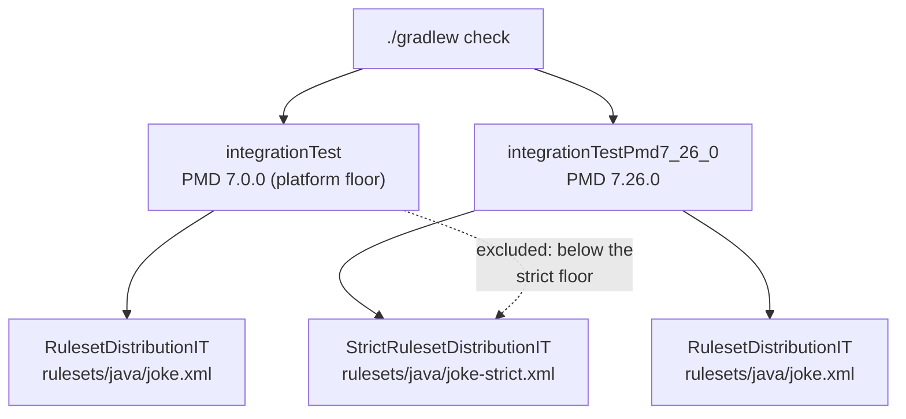

## Context

The artifact ships two rule resources today. `category/java/joke.xml` declares the eight rules;
`rulesets/java/joke.xml` selects all of them. Neither names anything outside this artifact, which is
what lets the jar resolve under every PMD 7.x and is written down as a requirement, a project rule
and a pair of integration-test scenarios.

The composition that turns those eight rules into a working analysis — six PMD stock categories,
twenty-two exclusions, three property overrides — is not shipped. It lives in `.pmd.xml` at the
repository root and reaches the build through `ruleSetFiles`. Consumers reproduce it by hand.

This change publishes that composition as a third resource. Doing so means the artifact will, for
the first time, name rules it does not own, in a file whose resolution depends on the consumer's PMD
version. The design below is mostly about confining that.

## Goals / Non-Goals

**Goals:**

- Ship the stock-category composition so a consuming build names a ruleset instead of maintaining
  one.
- Leave the existing two resources and their cross-version guarantee exactly as they are.
- Let `conventions.gradle` drop `ruleSetFiles` and the `$rootDir` reference that goes with it.
- Make the difference in PMD-version support between the resources explicit and enforced by the
  build, not stated in prose and hoped for.

**Non-Goals:**

- Changing which rules the composition enables, or any exclusion or property value. This change
  moves `.pmd.xml` verbatim; disagreements with its contents are a separate change.
- Raising or lowering the PMD floor for the rule classes. That stays 7.0.0.
- Adding the rules dependency to the convention plugin.
- Resolving whether PMD 7.0.0 treats an `<exclude>` of an absent rule as fatal. The design is
  arranged so the answer does not matter.

## Decisions

### A third resource, not a wider `rulesets/java/joke.xml`

Folding the composition into the existing convenience ruleset would give consumers a one-liner
without a new file name to learn. It would also mean the only ruleset that selects our rules now
drags in six stock categories, so the à-la-carte path documented in the README would run through
`category/java/joke.xml` alone, and the "resolves under any PMD 7.x" promise would have nothing left
to be true of.

`rulesets/java/joke-strict.xml` keeps the layering honest:

```
category/java/joke.xml          definitions — 8 rules, no external reference
      ▲
rulesets/java/joke.xml          our rules, all of them, no external reference
      ▲                         ← the any-PMD-7.x guarantee lives here
rulesets/java/joke-strict.xml   + 6 stock categories, 22 excludes, 3 overrides
                                ← names rules it does not own; narrower window
```

The name is doing work. `joke.xml` reads as "the rules called joke"; a consumer who typed it and got
`CognitiveComplexity` at a report level of 5 would be entitled to feel misled. `joke-strict.xml`
telegraphs the blast radius.

**Alternative considered:** `joke-all.xml`. Rejected — "all" suggests a superset of our rules, which
is what `joke.xml` already is, and says nothing about the opinions.

### The project rule narrows in scope rather than being abandoned

"Shipped resources must reference nothing outside this artifact" is a standing project rule, and
this change is the first thing to violate it. The rule is not wrong; it was written about resources
that carry a compatibility promise. It becomes: the catalogue and the convenience ruleset reference
nothing outside the artifact, and exactly one file is permitted to, under a stated support window
the build verifies.

Stating it that way keeps the rule enforceable. "No external references except where useful" would
not be.

### Two support windows, enforced by splitting the integration matrix

The rules hold their 7.0.0 floor. The strict ruleset declares 7.26.0.

The reason is concrete: `.pmd.xml` excludes `ImplicitFunctionalInterface`, and extracting
`category/java/*.xml` from `pmd-java-7.0.0.jar` and `pmd-java-7.26.0.jar` shows that name is absent
at 7.0.0 and present at 7.26.0. Every other stock name the composition mentions resolves at both.
Whether PMD 7.0.0 fails or merely warns on that exclude is unestablished — and deliberately left
that way, because an artifact should not ship a promise that rests on the answer. Declaring 7.26.0
makes the question moot; if it is later shown to be a warning, widening the window is a one-line
spec edit, where narrowing a shipped promise is not.

That means the cross-version matrix can no longer treat "the ruleset" as one thing:



The strict ruleset gets its own IT class rather than a branch inside the existing one, and Gradle
decides which tasks run it through `include`/`exclude` filters. `rules/build.gradle` carries a set
naming the versions that load the strict ruleset, validated against the versions the matrix actually
runs so a typo fails the build rather than silently skipping coverage.

**Alternative considered:** one IT class with a JUnit `assumeTrue` on `PMDVersion.VERSION`. Rejected
— an assumption that stops holding turns into a skipped test, which is indistinguishable in a build
log from a test that never ran. A missing Gradle task is visible in `./gradlew tasks`.

### `ruleSets` replaces `ruleSetFiles`, and the reason inverts cleanly

`conventions.gradle` documents why it uses `ruleSetFiles`: `ruleSets` is a `List<String>` that Gradle
cannot track as a file input, so editing `.pmd.xml` left `pmdMain` `UP-TO-DATE` against a stale
ruleset. That reasoning is sound and stops applying here. Once the ruleset is a classpath resource,
the input Gradle tracks is the `pmd` configuration — a `@Classpath` input on the `Pmd` task. Editing
the resource rebuilds the jar, the classpath changes, the task re-runs.

So the requirement does not soften into "either is fine": `ruleSetFiles` is right for a loose file
and `ruleSets` is right for a classpath resource, and this change moves from one to the other.
`ruleSets` must still be assigned rather than appended, because its Gradle default of
`category/java/errorprone.xml` otherwise survives.

A side benefit for the plugin's eventual extraction: `files("$rootDir/.pmd.xml")` was the block's
only tie to a repository layout.

### The rules dependency stays with each project

Setting `ruleSets` in the plugin means every project applying it must have the rules jar on `pmd`.
The plugin could add that itself, but then it needs a version — and for this repository the answer
is `project(':rules')`, which no coordinate expresses. Any plugin-side solution needs a
self-hosting escape hatch.

Leaving the dependency to each build avoids the problem entirely: `rules/build.gradle` keeps its
`ownRules` configuration and its `extendsFrom` arrangement unchanged, and an extracted consumer adds
one line. The plugin never learns its own version.

The cost is that a project applying the plugin without the dependency fails at ruleset resolution.
See Risks.

### `.pmd.xml` is deleted, and the dogfooding gets stronger

The obvious reading is that the repository loses its worked example of consumer-side composition. It
inverts: today `pmdMain` analyses this repository with a local file that resembles what a consumer
would write, and afterwards it analyses with the published resource itself. A fault in the shipped
composition now fails this build instead of someone else's.

The README's dogfooding section changes what it points at rather than disappearing, and the "Use it"
section shows the strict ruleset as the default path with the à-la-carte references kept below it.

## Risks / Trade-offs

- **The artifact now names rules it does not own; a PMD rename breaks the strict ruleset at load
  time.** → Confined to one file with a declared support window, and the matrix runs its floor on
  every `check`. A rename in a future PMD surfaces as a failing integration test here, before a
  release, rather than as a `RuleSetLoadException` in a consumer's build. Direct `<rule ref>` to a
  specific stock rule — the three property overrides — is the fatal case; excludes are the survivable
  one, which is another reason to keep the override count at three.

- **`pmdMain` runs at `toolVersion = 7.26.0`, the same version as the strict floor.** → Fine today,
  and a trap later: raising `toolVersion` without adding that version to the matrix would leave the
  strict ruleset verified only at a version nothing runs. The set naming strict-ruleset versions
  should be checked against the matrix, and the README should say `toolVersion` and the strict floor
  move together.

- **A project applying the convention plugin without the rules dependency fails at ruleset
  resolution.** → Accepted. The failure is immediate, names the missing resource, and is one line to
  fix; the alternative is a plugin that hardcodes its own version. Within this repository only
  `:rules` applies `java-base`, so the exposure is limited until the plugin is extracted, and the
  extraction is when the README instruction has to exist anyway.

- **Consumers cannot subtract from the strict ruleset through `ruleSets`.** → A consumer who wants
  the composition minus one rule needs their own file and `ruleSetFiles`, which is where they started.
  Accepted: the strict ruleset is for people who want the whole opinion, and
  `rulesets/java/joke.xml` remains for people who want the rules and their own composition.

- **Two support windows are harder to explain than one.** → They are also true, where one was not.
  The README states both, and each resource's window is asserted by a test rather than by prose.
