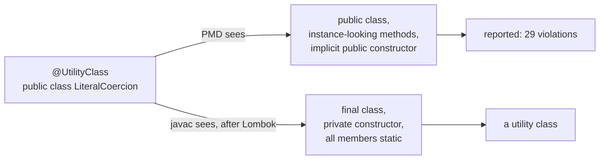
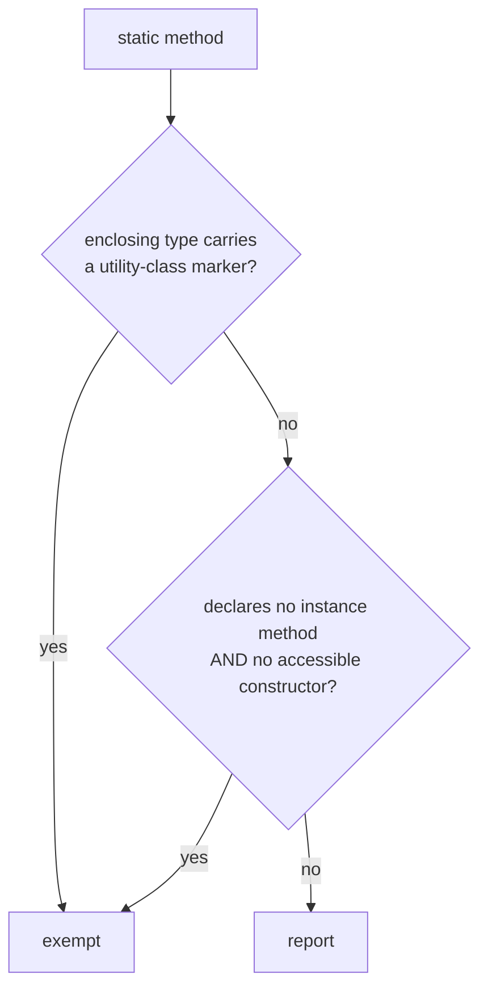
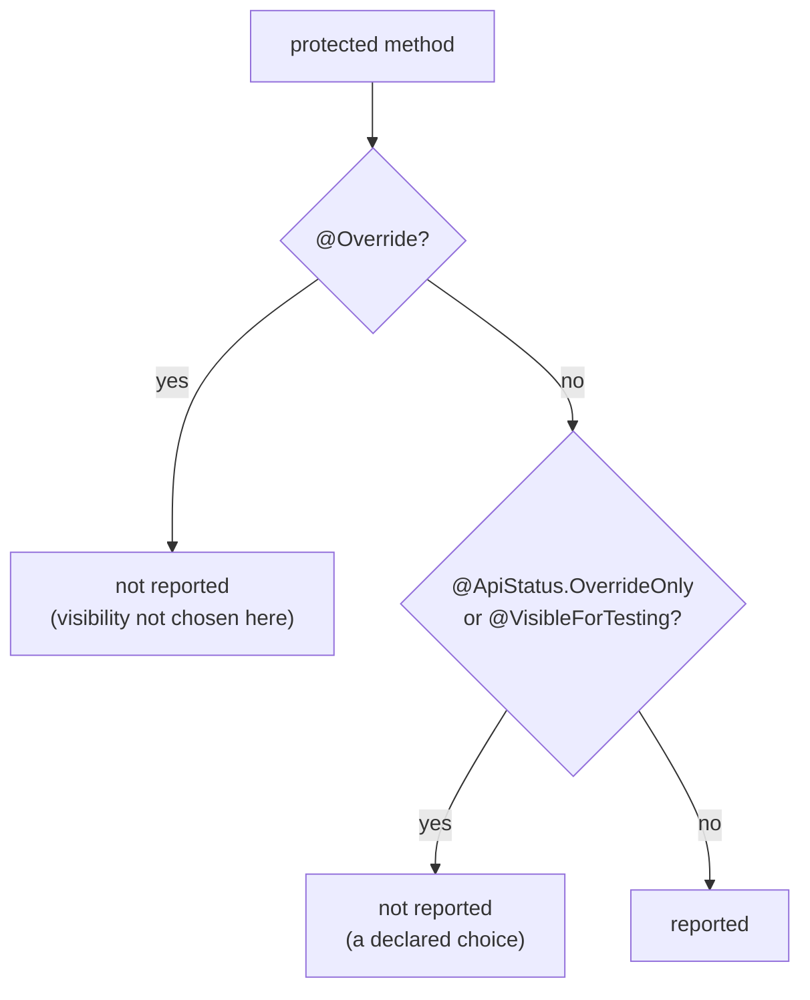

## Context

`percolate` is the first project to adopt `joke-strict` as the sole owner of its method-shape doctrine,
replacing four ArchUnit rules that enforced the same invariants against post-Lombok bytecode with a
whole-source-set view. The migration surfaces 97 violations from the two rules in this family, and every one
of them is a shape the bytecode rules deliberately allowed. That makes them a precise, externally-derived
false-positive corpus — the sort this artifact has not had before.

Two of the three gaps come from the same root: **PMD reads authored source, and both Lombok and the JLS put
meaning somewhere the source text does not show.**

The third gap is doctrinal rather than mechanical. `AvoidPrivateAndProtectedMethods` bans `protected` on the
reasoning that a test seam should be package-private, which widens to the test's package rather than to every
consumer's subclass. That reasoning holds only when the subclass shares the package. All eight `protected`
violations in `percolate` sit on published abstract bases (`Accessor`, `Container`) whose subclasses live in
other packages and other modules — package-private is not reachable from them at all, so the rule as written
demands a rewrite that does not compile.

## Goals / Non-Goals

**Goals:**

- Remove all three false-positive classes, for every consumer rather than for `percolate` specifically.
- Keep every exemption a **shape or a declared marker**, never a name list, so it cannot silently accumulate
  members.
- Stay within the PMD 7.0.0 compile floor and add no dependency to the published POM.
- Keep `protected` a decision the author must state, never a default that passes.

**Non-Goals:**

- Cross-file or cross-module subclass analysis. Still impossible, still out of scope — the marker exists
  precisely so the question never has to be asked.
- Any new rule. All three changes extend rules that already exist.
- Making any rule stricter. Every change removes reports; no consumer's build newly fails.
- Configuration properties for the marker set. Considered and rejected — see D4.

## Decisions

### D1 — A named constructor is exempt, matched on the AST by simple name

A `static` method whose return type is its own declaring type, or an interface that type declares it
implements, is exempt. The justification is the same one the modifier rule rests on: a test double over such
a factory could only return what the constructor it wraps already returns, so there is nothing to intercept.
It is not a helper hiding behind `static` — it is the constructor, named.

Matching is on the AST, comparing **simple names**: the method's result-type node against the enclosing
type's name, then against the names in its `implements` clause. No type resolution, consistent with
`UseVisibleForTestingAnnotation`'s documented reasoning — resolution needs an `auxclasspath` that consumers
frequently do not configure, and a misconfigured one makes a rule silently pass.

The cost is that a factory returning a same-named type from a different package is exempted too. Accepted:
the alternative silently under-reports whenever the consumer's `auxclasspath` is wrong, which is the worse
failure because it is invisible.

Only the declaring type and its **directly declared** interfaces count. A factory returning a superclass or a
transitively-inherited interface is still reported — that shape is a factory for something else, which is a
helper.

### D2 — `@UtilityClass` is recognised by simple name, short-circuiting the structural test

Order matters, because Lombok's rewriting defeats the structural test in two independent ways:

The marker check must come **first**: under `@UtilityClass` the source declares methods without `static` and
declares no constructor at all, so `declaresNoInstanceMethod` and `declaresNoAccessibleConstructor` both fail
on a class that is, after annotation processing, exactly the shape the exemption describes.

Held as a `Set` of simple names alongside the existing `STATIC_REQUIRED_BY_FRAMEWORK`, seeded with
`UtilityClass`. A set rather than a constant because the same source-level trick is not unique to Lombok, and
because the existing carve-out already establishes the pattern.

This does **not** make the rule depend on Lombok: nothing is imported, and a project without Lombok simply
never matches the name.

### D3 — `protected` is permitted when marked, and only when marked

Two markers, two meanings: `OverrideOnly` says *implementors override this*, `VisibleForTesting` says *this
was widened for a test*. An unmarked `protected` is still reported, so the modifier can never be a default
that slips through — which preserves the rule's purpose of removing discretion. What it hands back is a
choice between two *documented* intents, not a choice about whether to think.

Matched by simple name, as everywhere else in this artifact. `@ApiStatus.OverrideOnly` is a nested
annotation, so both the directly-imported `@OverrideOnly` and the outer-type-qualified
`@ApiStatus.OverrideOnly` spelling must match — but **one set entry covers both**, and the set must not carry
a second `ApiStatus.OverrideOnly` member. PMD's `ASTAnnotation.getSimpleName()` delegates to
`ASTClassType.getSimpleName()`, which is the last identifier and carries an assertion that it contains no
dot; the outer type is reachable only through `getQualifier()`. A dotted entry would therefore be dead code
that no input could ever match, and pitest would report it as such. Both spellings are still covered by test
data, because that is a property of the AST rather than of this rule and nothing in the rule would notice if
it changed.

**The stock-rule requirement survives intact.** `AvoidProtectedMethodInFinalClassNotExtending` and
`AvoidProtectedFieldInFinalClass` fire on `protected` in a `final` class, and this change does not put us in
opposition to them: in a `final` class `OverrideOnly` is meaningless (nothing can override) and a test seam
has no reason to widen past package-private, since no out-of-package subclass can exist. So the stock rules
remain correct where they fire, and `.pmd.xml` still excludes neither. This is worth an explicit scenario,
because it is the requirement most obviously threatened by permitting `protected` at all.

### D4 — The marker set is hardcoded, not a property

A `permittedMarkers` property was considered and rejected. This artifact's rules take no configuration
today, and their stated purpose is to remove discretion; a property that lets each consumer choose which
annotations legitimise `protected` reintroduces exactly the per-project drift the rule exists to prevent.
Two markers, fixed, with `@SuppressWarnings` as the documented escape for anything else.

### D5 — The rules still cascade, and the order is unchanged

`AvoidPrivateAndProtectedMethods` continues to defer a `static` method to `StaticMethodsModifyStaticState`,
so one method yields one violation with one obvious fix. The two new static exemptions mean fewer methods
reach that rule at all; nothing about the ordering changes, but the README's *The rules cascade* section
needs to state that a `static` named constructor now exits the cascade rather than being reported by it.

### D6 — The AST accessors are pinned, and all four exist at PMD 7.0.0

Recorded so a later PMD upgrade cannot silently swap one for a newer spelling. Each was verified against
`pmd-java-7.0.0.jar` itself rather than against the version the build happens to resolve, because the
dependency is `compileOnly` at the floor and a missing method surfaces as `NoSuchMethodError` inside a
consumer's analysis, never here.

| Need | Accessor | Returns |
|---|---|---|
| the method's result type | `ASTMethodDeclaration.getResultTypeNode()` | `ASTType` |
| its simple name | `ASTClassType.getSimpleName()` | `String` |
| the enclosing type's simple name | `ASTTypeDeclaration.getSimpleName()` | `String` |
| the directly declared interfaces | `ASTTypeDeclaration.getSuperInterfaceTypeNodes()` | `NodeStream<ASTClassType>` |

Two properties of these matter beyond their existence:

- **`getSuperInterfaceTypeNodes()` is purely syntactic.** At 7.0.0 it is
  `ASTList.orEmptyStream(isInterface() ? firstChild(ASTExtendsList.class) : firstChild(ASTImplementsList.class))`
  — a child lookup, no symbol table, no `auxclasspath`. D1 depends on this. It also reads an interface's
  `extends` clause, which is the same "directly declared interfaces" notion, so the rule behaves consistently
  on both kinds of type.
- **Narrowing the result type to `ASTClassType` is what excludes `void` and the primitives.** `void` parses to
  `ASTVoidType` and `int` to `ASTPrimitiveType`; neither is an `ASTClassType`, so both fall through to a
  report without a special case. An array return (`Foo[]`, an `ASTArrayType`) falls through the same way,
  which is correct — an array of the declaring type is not the constructor.

## Risks / Trade-offs

- **An AST accessor used for D1 does not exist at the PMD 7.0.0 floor** → the floor is `compileOnly` and a
  missing method surfaces as `NoSuchMethodError` inside a consumer's analysis, not at build time here. The
  existing `RulesetDistributionIT` / range-coverage machinery must exercise the new paths at the floor, and
  the floor is not to be raised to make this easier.
- **Simple-name matching exempts a factory returning a same-named type from another package** (D1) →
  accepted, and documented in the rule description. The failure is a missed report, which review can catch;
  the alternative fails silently on every misconfigured `auxclasspath`.
- **`@UtilityClass` recognition trusts an annotation the rule cannot verify** (D2) → a class that carries the
  annotation without Lombok on the processor path is exempted while being an ordinary public class. This is
  the same trust `UseVisibleForTestingAnnotation` already places in simple-name matching, and the shape is
  self-declaring.
- **Permitting `protected` weakens a rule whose stated value is having exactly two legal forms** (D3) →
  mitigated by requiring the marker unconditionally, so the count of *undeclared* forms stays at zero. The
  README must carry the reasoning, or the next reader will read it as the rule going soft.
- **Pitest is at 100/100/100** → three new branches with several exemption shapes each. Every branch needs a
  test case in both directions, and the `@ApiStatus.OverrideOnly` nested-name spelling is the one most likely
  to leave a surviving mutant.
- **`percolate` is blocked until this releases** → its first task group pins a released version, so a
  snapshot is not enough. Release before that change starts.
