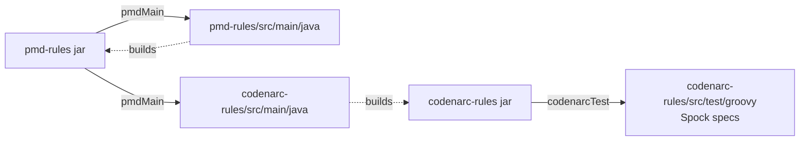
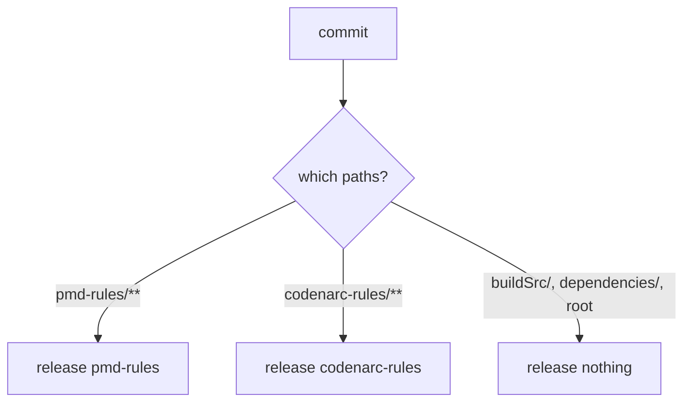

## Context

The repository publishes one artifact, `io.github.joke.pmd:rules`, currently at `0.1.0` on Maven
Central. Its identity is single-tool throughout: repository name, Gradle group, Java package, module
layout, `release-please` manifest and the `build-foundation` spec all name PMD. `build-foundation`
states the constraint outright — *"exactly three Gradle projects"*, *"`settings.gradle` includes
`rules` and `dependencies` and nothing else"*.

CodeNarc is already present but deliberately inert. The convention plugin carries a full CodeNarc
block guarded by `pluginManager.withPlugin('groovy')`, and `.codenarc.groovy` sits at the repository
root with ~150 curated stock rules. `build-foundation` records why: the convention plugin is destined
for extraction and reuse by projects that do use Groovy. That guard now has to open.

Two facts found during exploration shape the design more than anything else:

- **CodeNarc's rule infrastructure is Java.** `AbstractRule`, `AbstractAstVisitor` and
  `AbstractAstVisitorRule` all report `Compiled from "*.java"`. CodeNarc's stock rules are Groovy by
  taste, not by requirement. Its `AbstractRuleTestCase` ships in the **main** jar and is already
  JUnit 5 — there is no `pmd-test` equivalent to depend on.
- **Gradle cannot be handed a classpath ruleset.** Gradle 9.6.1's `CodeNarcInvoker` hardcodes
  `ruleSetFiles = "file:" + parameters.getConfig().getAsFile()`, and `CodeNarcActionParameters`
  exposes only `config`, `compilationClasspath`, the three thresholds, reports, `ignoreFailures` and
  `source`. There is no classpath knob. CodeNarc's own `RuleSetUtil`, however, resolves nested
  `ruleset(...)` references through a `ResourceFactory` that reads the classpath.

## Goals / Non-Goals

**Goals:**

- Two independently versioned artifacts from one repository, each dogfooded by the build that
  produces it.
- Preserve every quality gate that currently applies to rule code — Error Prone, NullAway, Spotless,
  `-Werror`, Pitest at 100/100/100 — for the CodeNarc rules too.
- Keep the shipped ruleset the single source of policy, with no repository-relative path in the
  convention plugin, so the plugin stays extractable.
- Leave consumers of the retired coordinate a machine-readable forwarding address.
- Land exactly one Spock rule, so that every gate the module claims — Pitest, PMD over the rule
  classes, CodeNarc over the specifications — is demonstrated against real rule code rather than
  asserted over an empty module.

**Non-Goals:**

- Writing the rest of the Spock rules. `AvoidUnrollAnnotation` ships here because Pitest's
  `failWhenNoMutations` makes a rule-less module unbuildable and because one real rule proves the
  loop; the remaining conventions land one change at a time, matching how the PMD rules landed.
- Porting the PMD opinions to Groovy. The two rule families are disjoint: PMD enforces Java style,
  CodeNarc enforces Spock structure. There is no shared rule intent to keep in sync.
- Migrating `pmd-rules`' tests to Spock. `pmd-test`'s `RuleTst` plus XML fixtures stays, and
  `pmd-rule-distribution` keeps that requirement.
- Supporting CodeNarc's Groovy 3 or Groovy 4 artifact lines. See Decision 8.
- Formatting Groovy. See Decision 11.

## Decisions

### 1. Four Gradle projects; project name equals artifactId

```
lint-rules/
├── buildSrc/           conventions plugin
├── dependencies/       java-platform, unpublished
├── pmd-rules/          io.github.joke.lint:pmd-rules
└── codenarc-rules/     io.github.joke.lint:codenarc-rules
```

Moving the group to `io.github.joke.lint` makes the Gradle project names equal the artifactIds, so no
publication needs an explicit `artifactId` override and `metadata { readableName = project.name }`
keeps working unchanged. The alternative considered — keeping `io.github.joke.pmd:rules` and adding
`io.github.joke.codenarc:rules` — preserved the live coordinate but forced two projects to be named
`rules`, or forced an artifactId pin that diverges from the project name. Since the user accepted the
coordinate move, the simpler layout wins.

`dependencies` stays unpublished: it applies `java-platform` and `conventions` but not
`maven-publish`, so the convention plugin's publishing wiring never fires for it. That is unchanged.

### 2. Packages align with the group

`io.github.joke.pmd.rules.java` → `io.github.joke.lint.pmd.rules.java`, and the new module uses
`io.github.joke.lint.codenarc.rules.spock`. Doing this in the same change as the coordinate move
means one break rather than two. The class names appear in `category/java/joke.xml`, which is a
shipped resource, so this is consumer-visible for anyone referencing a rule class directly — a path
the README has never documented.

### 3. CodeNarc rules in Java, tests in Groovy/Spock

Main source is Java because CodeNarc's base types are Java and Groovy's AST (`org.codehaus.groovy.ast.*`)
is Java, so nothing about writing a CodeNarc rule requires Groovy. Keeping main source in Java keeps
Error Prone, NullAway in JSpecify mode, `-Werror`, Palantir formatting and Pitest applying to rule
code exactly as they do in `pmd-rules`.

Test source is Groovy/Spock because it is the only way this module dogfoods. It also gives the
ergonomic harness: `AbstractRuleTestCase`'s assertion API takes `Closure` and `Map...` overloads that
read naturally from Groovy.

Alternatives considered:

- *All Groovy.* Idiomatic against CodeNarc's own rules and the richest dogfood corpus, but forfeits
  NullAway and Error Prone entirely, and `mutationThreshold = 100` with `mutators = ['ALL']` against
  Groovy bytecode — synthetic `$getStaticMetaClass`, `__$stMC`, call-site scaffolding — is not
  realistically reachable without exclusions.
- *All Java.* Keeps every gate but leaves no Groovy in the repository at all, so the published
  CodeNarc rules would never be run on real code by the build. That breaks `build-foundation`'s
  *"The build runs the rules it publishes"*, a requirement with a long recorded rationale.

The split takes the quality stack from one and the dogfooding from the other.

Boundary note: applying the `groovy` plugin also creates `codenarcMain` over `src/main/groovy`, which
stays empty, and `pmdTest` over `src/test/java`, likewise. Both are no-ops and are left alone rather
than disabled.

### 4. The dogfooding graph closes over both artifacts



Each module declares its own analysis dependency, following the existing requirement that the
convention plugin never names this project's own artifact:

- `pmd-rules/build.gradle`: `pmd project(':pmd-rules')` — unchanged in shape.
- `codenarc-rules/build.gradle`: `pmd project(':pmd-rules')` **and**
  `codenarc project(':codenarc-rules')`.

The second is self-referential in exactly the way `pmd-rules` already is, and carries the same
consequence: a rule that throws during analysis breaks the module that builds it. The README's
existing recovery path (exclude the analysis tasks to build past a broken rule) extends to
`codenarcTest`.

### 5. The shipped CodeNarc ruleset is Groovy DSL, not XML

CodeNarc's `RuleRegistryInitializer` instantiates only `PropertiesFileRuleRegistry`, whose
`PROPERTIES_FILENAME` is the hardcoded `codenarc-base-rules.properties`. Bare rule names therefore
resolve only for rules registered in CodeNarc's own jar. Two consequences:

- The XML form (`<rule class='…'/>`) would require a fully-qualified class name for each of the ~150
  stock rules ported from `.codenarc.groovy`. The Groovy DSL accepts the bare names.
- This artifact's own rules are referenced by class — `rule(io.github.joke.lint.codenarc.rules.spock.…)`
  — not by bare name. Consumers reference the shipped ruleset rather than individual rules, so this
  costs nothing.

Layout mirrors the PMD side's two-file split, minus the category concept CodeNarc does not have:

| Resource | Role |
| --- | --- |
| `rulesets/groovy/joke.groovy` | every rule this artifact defines |
| `rulesets/groovy/joke-strict.groovy` | the whole analysis this project runs on itself: the ported stock composition plus `ruleset('rulesets/groovy/joke.groovy')` |

At the start of this change `joke.groovy` is empty of rules and `joke-strict.groovy` is the ported
`.codenarc.groovy`. Both ship from day one so the follow-up rule changes have somewhere to land.

`joke.groovy` references only this artifact's own classes, so it resolves identically under every
supported CodeNarc. `joke-strict.groovy` is the file that names stock rules, and it therefore carries
the narrower support window — a stock rule renamed or removed by a later CodeNarc is a ruleset-load
failure there and nowhere else. This is the same two-window split `joke.xml` and `joke-strict.xml`
already carry on the PMD side.

### 6. Classpath resolution through a one-line stub

**Verified end to end by the spike in task 1.** Given Gradle always passes a `file:` URI, the
convention plugin supplies a stub whose only content is a classpath reference:

```groovy
codenarc {
    config = resources.text.fromString("ruleset { ruleset('rulesets/groovy/joke-strict.groovy') }")
}
```

The nesting is required, not incidental. `RuleSetBuilder` exposes only `ruleset(Closure)` at the top
level; `ruleset(String)` is a method on `TopLevelDelegate`, the closure's delegate. A stub written as
a bare `ruleset('…')` fails at analysis time with
`No signature of method: GroovyDslRuleSet$_createGroovyShell_closure1.doCall() is applicable for
argument types: (String)`.

`RuleSetUtil` dispatches on extension — `isXmlFile` → XML, `isJsonFile` → JSON, **else** →
`GroovyDslRuleSet`. A `fromString` text resource materializes to a temp file with no meaningful
extension and therefore lands in the Groovy DSL branch, which is what the stub is written in. The
`ruleset(…)` call inside then resolves off the worker's classpath, which Gradle builds from the
`codenarc` configuration — where each module has declared the rules artifact.

The spike confirmed all four links: the stub parses as Groovy DSL, `joke-strict.groovy` resolves from
the classpath, its own nested `ruleset('rulesets/groovy/joke.groovy')` resolves from the classpath in
turn, and `rule(<Class>)` resolves a Java-implemented rule out of the same jar and fires it. It also
confirmed a stock rule from the composition firing, so the two halves compose.

This satisfies the same three properties `build-foundation` demands of the `pmd` block:

- No `$rootDir` or repository-relative path, so the plugin survives extraction.
- The policy lives in the published jar, not in a loose file, so the composition under analysis is
  the shipped one.
- Input tracking is preserved: the `codenarc` configuration is a classpath input on the task, so
  editing the shipped ruleset rebuilds the jar, changes the classpath, and re-runs analysis.

`.codenarc.groovy` is deleted. Consumers get the same three lines in their own build, documented in
the README.

Alternative considered: `resources.text.fromArchiveEntry(configurations.codenarc, 'rulesets/groovy/joke-strict.groovy')`,
which extracts the real shipped file rather than a stub referencing it. Rejected as the primary
approach because `configurations.codenarc` resolves to many jars and the entry lookup across a
multi-jar `FileCollection` is unverified — but it remains the fallback if the spike in Decision 6's
risk row fails.

### 7. The build sits on the Groovy 5 line

Three coupled artifacts must agree on a Groovy line, because CodeNarc parses `.groovy` **source**
with its own embedded Groovy: if the Spock specs use syntax newer than CodeNarc's parser, analysis
fails on source that compiles fine.

| | Chosen |
| --- | --- |
| Groovy | 5.0.x |
| Spock | `2.4-groovy-5.0` |
| CodeNarc | `4.0.0` — both floor and tool |

The Groovy 4 line was the first choice, on the grounds that CodeNarc 4.0.0 was too recent to be a
floor. Implementation overturned it: the ported composition names `SpockMissingAssert`, which
CodeNarc only added in 3.3.0, so the Groovy 4 line could not carry the composition at its own oldest
release and would have forced a second support window purely to accommodate one rule. Verified
against 4.0.0 instead: all 112 composition rules resolve, `AbstractRuleTestCase` still ships in the
main jar, and `AbstractRule` / `AbstractAstVisitor` / `AbstractAstVisitorRule` are still Java. The
whole stub-to-classpath-to-rule-class chain was re-run on 4.0.0 and behaves identically.

Gradle 9 embeds Groovy 4 rather than 5, which is harmless: `buildSrc` does not apply `conventions`,
so CodeNarc never analyses the build scripts and the two lines never meet.

The line choice constrains the **bytecode** of the rule classes, not just the source. A ruleset that
names a rule by class makes CodeNarc load that class through Groovy's ASM, and a Groovy older than
the compiling JDK rejects anything above its supported class-file version: with rule classes compiled
on Liberica 25 without a `release` setting, the spike failed on Groovy 4.0.24 with `BUG! exception in
phase 'semantic analysis' … Unsupported class file major version 69`. The existing
`options.release = 11` already keeps the rule classes well below that ceiling, so this is satisfied
today — but it means raising the release level is coupled to the analysing CodeNarc's Groovy, not
only to the consumers this artifact wants to reach.

### 8. CodeNarc is compile-only at a stated floor, and the support window is the Groovy 4 line

Mirroring the PMD policy exactly: `org.codenarc:CodeNarc` is `compileOnly` at the floor, the published
POM declares no dependency, and the consumer supplies CodeNarc on Gradle's `codenarc` configuration
at a version of their choosing. `testImplementation` sits at the same floor so `AbstractRuleTestCase`
is exercised at the oldest supported version, while the convention plugin's tool coordinate runs
newer — the same split as `pmd-test` at 7.0.0 against `pmd-dist` at 7.26.0.

**Groovy must be declared `compileOnly` alongside CodeNarc.** CodeNarc's POM puts every Groovy
module at `runtime` scope, so `compileOnly 'org.codenarc:CodeNarc'` alone does not put
`org.codehaus.groovy.ast.*` on the compile classpath, and a Java rule extending `AbstractAstVisitor`
fails to compile with `cannot access ClassCodeVisitorSupport`. This has no effect on the published
POM — a second `compileOnly` declaration reaches it no more than the first does — and it is the one
place where writing CodeNarc rules in Java costs a line that writing them in Groovy would not.

The floor is **`4.0.0`**, which is also the oldest CodeNarc on the Groovy 5 line and the version the
convention plugin uses as the analysis tool. Floor and tool coincide here, unlike the PMD side where
`pmd-test` sits at 7.0.0 and `pmd-dist` at 7.26.0; they will diverge as soon as CodeNarc 4.0.1 ships
and the tool moves ahead.

Because the composition and the rule classes share one floor, there is **no second support window**.
`joke-strict.groovy` names rules this artifact does not define, so it still carries the narrower
promise in principle — but at 4.0.0 every name in it resolves, which the integration specification
asserts on every build.

CodeNarc's compatibility surface is two-dimensional in a way PMD's is not: the coordinate itself
encodes the Groovy line (`3.7.0` for Groovy 3, `3.7.0-groovy-4.0` for Groovy 4, `4.0.0` onward for
Groovy 5, suffix dropped). The rule classes reference only `AbstractAstVisitorRule`,
`AbstractAstVisitor`, `Violation`, `SourceCode` and `org.codehaus.groovy.ast.*`, all of which are
plausibly stable across all three lines — but plausible is not tested. The artifact therefore
**claims** the Groovy 5 line at 4.0.0 or later and claims nothing else. Widening that is a change
with a test matrix behind it, not a README edit.

### 9. Multi-package `release-please`, and the path-routing trap

```json
{
  "packages": {
    "pmd-rules":      { "release-type": "simple" },
    "codenarc-rules": { "release-type": "simple" }
  }
}
```

with `{"pmd-rules": "0.1.0", "codenarc-rules": "0.0.0"}` in the manifest. `pmd-rules` carries its
version forward across the coordinate move — coordinate discontinuity is enough discontinuity for one
release. Tags become component-prefixed.

`release-please` routes a commit to a package by **which files it touched**, not by conventional
commit scope:



The third branch is the trap. A CodeNarc or PMD floor bump lives in `dependencies/build.gradle` and
genuinely changes what an artifact compiles against, yet routes to no package and cuts no release.
The rule adopted here: **a change that alters what a module publishes must touch that module.** A
floor bump edits the platform *and* the module's `build.gradle`, which is where the `compileOnly`
declaration already sits, so in practice this falls out naturally. It is stated in
`build-foundation` so it is not rediscovered.

This is also the first real exercise of `io.github.joke.conventional-version`'s multi-package
support. The cases it must handle are enumerated in Risks.

### 10. The retired coordinate gets a relocation POM

A POM-only publication at `io.github.joke.pmd:rules` carrying:

```xml
<distributionManagement>
  <relocation>
    <groupId>io.github.joke.lint</groupId>
    <artifactId>pmd-rules</artifactId>
  </relocation>
</distributionManagement>
```

Maven and Gradle both surface a relocation as a warning naming the new coordinate, which is the
whole point: a consumer who never reads a changelog still gets told.

It is published **once**, alongside the first release after the move, and the publication block is
then removed in a follow-up change. Keeping it would emit a fresh relocation POM at every subsequent
version under a coordinate nobody is pinned to.

This gets rehearsed for free. Every push to `main` that does not cut a release already publishes
signed snapshots specifically so the release path is exercised before it matters, so a Central Portal
rejection of a POM-only publication surfaces on a snapshot that can be republished.

**The relocation must not be published at a version already on Central.** It takes `project.version`,
and `io.github.joke.pmd:rules:0.1.0` already exists — Central refuses to overwrite a released GAV. In
practice this resolves itself: the commit that lands this change bumps `pmd-rules` past 0.1.0, so the
relocation POM goes out at a fresh version under the old coordinate. It is recorded because a release
attempted from an unbumped tree would fail at the publish step for a reason that reads as unrelated.

The relocation also only reaches consumers who resolve a version newer than the one they are pinned
to. Someone hard-pinned to `0.1.0` keeps getting `0.1.0` and is never told; the README migration note
covers them.

### 11. Spotless stays Java-only; Groovy is unformatted

The convention plugin keeps its `spotless { java { … } }` block and gains nothing for Groovy.
Spotless's Groovy support is `greclipse`, which reformats Spock's labelled-block layout badly enough
to fight the specs it is meant to tidy. CodeNarc carries Groovy style instead. This is a deliberate
gap, stated in `build-foundation` so it reads as a decision rather than an oversight.

### 12. The convention plugin loses its hardcoded description

`description = 'Custom PMD 7 rules, …'` currently sits inside the plugin's metadata block and is
correct for exactly one artifact. It moves to each module's `build.gradle`. `group` stays a constant
in the plugin, changing to `io.github.joke.lint`.

## Risks / Trade-offs

- **The classpath stub may not resolve inside Gradle's ant worker** → `RuleSetUtil` carries a
  `codenarc.useCurrentThreadContextClassLoader` system property, so which classloader sees the
  rules jar is not certain from static reading alone. This is the first task in the plan; a negative
  result switches to `fromArchiveEntry` (Decision 6's alternative) or, failing that, a generated stub
  file under `layout.buildDirectory` with a controlled extension. All three keep `$rootDir` out of the
  plugin, so the spike's outcome changes the mechanism, not the design.

- **The ported stock ruleset will fire against the new Spock specs** → `UnusedVariable` and
  `UnusedPrivateField` misread `where:`-block variables and `@Shared` fields; `UnnecessaryDefInMethodDeclaration`
  and `MethodName`-style rules misread `def "feature name"()`. Triaging the first wave into
  exclusions is in scope here. Each exclusion is a recorded gap and the evidence for a follow-up
  Spock rule, so this is requirements-gathering rather than pure cost.

- **`conventional-version` may not cover every multi-package case** → the cases to verify are: two
  packages resolving independently; a Gradle project absent from the manifest (`:dependencies` and the
  root, where `build-foundation` currently asserts `:dependencies` is not `unspecified`);
  component-prefixed tag discovery; and a package at `0.0.0` with no tag in history at all
  (`codenarc-rules` on day one). A gap here blocks the release wiring but not the module split, so the
  two are sequenced separately in the plan.

- **Pitest at 100/100/100 over Java main with Spock tests** → mutation runs against Java bytecode, and
  the JUnit 5 plugin executes Spock specs on the JUnit Platform, so the mechanism is sound. The
  exposure is `@spock.lang.Tag('unit')` being picked up by both `useJUnitPlatform { includeTags 'unit' }`
  and Pitest's `includedGroups = ['unit']`. Confirmed working by the user; verified again by the first
  green `check`.

- **`codenarc-rules` ships a jar with no rules of its own** → the first release is a stock composition
  in a wrapper. That is intentional: it makes the distribution mechanism, the dogfooding loop and the
  release wiring all provable before any rule logic exists to confound them.

- **The relocation POM may be rejected by Central Portal** → POM-only publications are a standard
  documented pattern, but the Portal validates more strictly than legacy OSSRH. Mitigated by the
  snapshot rehearsal described in Decision 10; if rejected, the fallback is a README-only migration
  note and the publication block is dropped.

## Migration Plan

1. Spike the classpath stub (Decision 6) in a throwaway build. Everything else assumes it.
2. Rename and split the modules, move packages, retarget the group. No behaviour change; `check`
   must stay green on the PMD side throughout.
3. Add `codenarc-rules` with the Groovy/Spock test wiring, the ported ruleset, and both analysis
   dependencies. Triage the first violation wave.
4. Rewire `release-please` to the multi-package manifest and verify `conventional-version` against
   the cases in Risks.
5. Add the relocation publication, rehearse it on a snapshot, release, then open the follow-up to
   remove it.

Rollback: steps 2–3 are ordinary source changes revertible before any release. Step 5 is the only
irreversible one — a published relocation POM cannot be withdrawn from Central — and it is
deliberately last and rehearsed.

## Open Questions

- Does the relocation publication need `sources`/`javadoc` jars and a signature to pass Central
  Portal validation, or is a signed POM alone accepted? Resolved by the snapshot rehearsal in step 5.
- Should `codenarc-rules`' first release wait until it carries at least one rule of its own, or ship
  the stock composition immediately? The plan assumes immediately, so the release wiring is proven
  before rule work starts; deferring is a one-line manifest change if preferred.
